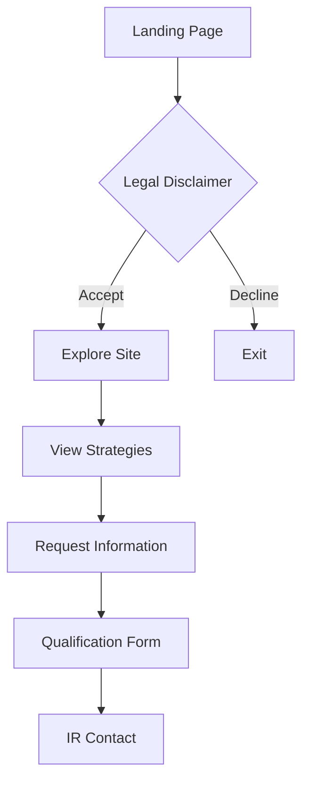
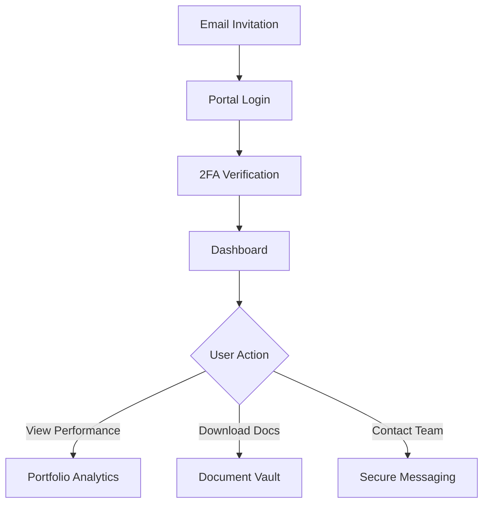
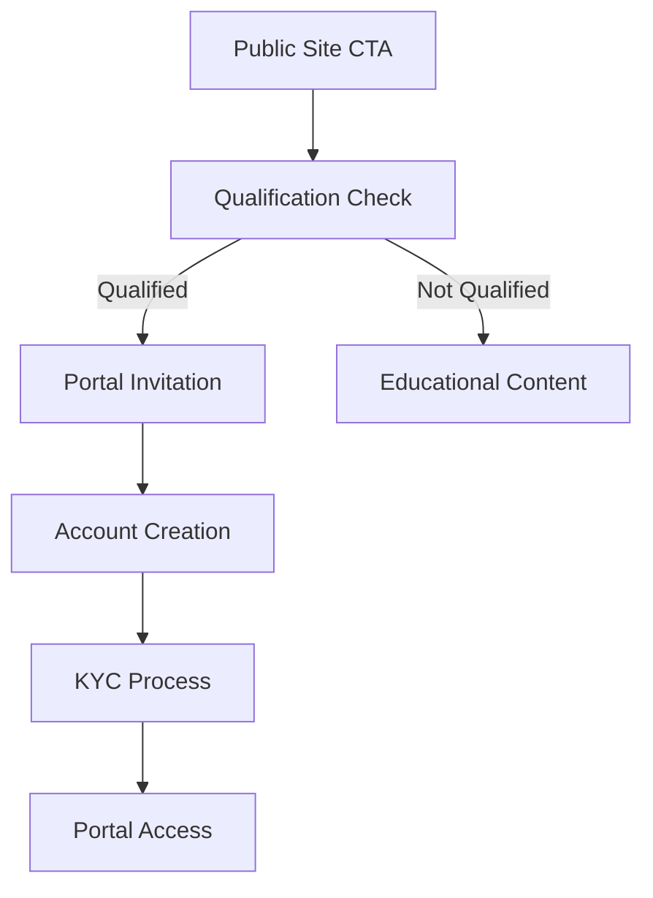

# Fuerte Financial Technologies - Information Architecture

## Overview

The Fuerte digital presence is strategically bifurcated into two distinct experiences:

1. **Public Marketing Site** (www.fuerte.tech) - Dynamic, narrative-driven, tech-forward
2. **Investor Portal** (investors.fuerte.tech) - Secure, data-driven, institutional-grade

This separation allows authentic expression of both the innovative tech firm and trusted financial steward identities.

## 🌐 Public-Facing Site Structure

### Primary Navigation
```
HOME | ABOUT | PHILOSOPHY | STRATEGIES | INSIGHTS | CONTACT
```

### Site Map

```
www.fuerte.tech/
│
├── / (Home)
│   ├── Hero Section with WebGL Visualization
│   ├── Value Proposition
│   ├── Key Metrics Showcase
│   └── Qualified Investor Gateway
│
├── /about
│   ├── /about/story (The Fuerte Story)
│   ├── /about/team (Leadership & Advisors)
│   ├── /about/careers (Join Our Mission)
│   └── /about/press (Media Resources)
│
├── /philosophy
│   ├── Investment Approach (Scroll-driven narrative)
│   ├── Technology Stack
│   ├── Risk Management
│   └── Alpha Generation Process
│
├── /strategies
│   ├── /strategies/ai-quant (AI Quantitative Fund)
│   ├── /strategies/digital-alpha (Digital Asset Alpha Fund)
│   ├── /strategies/market-neutral (Market Neutral Strategy)
│   └── /strategies/custom (Bespoke Solutions)
│
├── /insights
│   ├── /insights/research (White Papers)
│   ├── /insights/market-views (Commentary)
│   ├── /insights/technology (Tech Deep Dives)
│   └── /insights/subscribe (Newsletter)
│
├── /contact
│   ├── Secure Contact Form
│   ├── Office Locations
│   └── Investor Relations
│
└── /legal
    ├── /legal/disclaimer
    ├── /legal/privacy
    └── /legal/terms
```

## 🔒 Investor Portal Structure

### Subdomain Architecture
```
investors.fuerte.tech/
│
├── / (Login Gateway)
│   ├── Secure Authentication
│   ├── Two-Factor Verification
│   └── Forgot Password
│
├── /dashboard
│   ├── Portfolio Overview
│   ├── Performance Metrics
│   ├── Recent Activity
│   └── Quick Actions
│
├── /portfolio
│   ├── /portfolio/holdings
│   ├── /portfolio/performance
│   ├── /portfolio/analytics
│   └── /portfolio/reports
│
├── /documents
│   ├── /documents/statements
│   ├── /documents/reports
│   ├── /documents/tax
│   └── /documents/legal
│
├── /communications
│   ├── /communications/inbox
│   ├── /communications/alerts
│   └── /communications/team
│
└── /account
    ├── /account/profile
    ├── /account/security
    └── /account/preferences
```

## 🔄 User Flows

### 1. New Visitor Journey



### 2. Qualified Investor Journey



### 3. Public to Private Transition



## 🎯 Key Design Principles

### Public Site
- **Visual Impact**: High-impact animations, premium aesthetics
- **Narrative Flow**: Story-driven content progression
- **Thought Leadership**: Demonstrate expertise without revealing proprietary information
- **Conversion Focus**: Subtle, sophisticated CTAs for qualified leads

### Investor Portal
- **Security First**: Bank-grade authentication and encryption
- **Data Clarity**: Clean, professional data visualization
- **Efficiency**: Quick access to critical information
- **Trust Building**: Consistent, reliable performance

## 📋 Content Strategy

### Public Content Types
1. **Marketing Pages**: Brand story, value propositions
2. **Educational Content**: Investment philosophy, market insights
3. **Thought Leadership**: Research papers, market commentary
4. **Social Proof**: Select performance metrics, testimonials

### Private Content Types
1. **Performance Data**: Real-time portfolio metrics
2. **Legal Documents**: Contracts, statements, tax forms
3. **Exclusive Research**: Detailed strategy explanations
4. **Personal Communications**: Direct IR messaging

## 🔐 Security & Compliance

### Legal Requirements
- Accredited investor disclaimers on entry
- Clear separation of marketing and performance data
- Regulatory compliance notices
- Terms of service and privacy policies

### Technical Security
- SSL certificates for all domains
- Two-factor authentication for portal
- Encrypted document storage
- Session management and timeout
- Audit trails for all actions

## 🎨 Visual Hierarchy

### Public Site
```
Hero Impact ████████████████████
Navigation  ████████████
Content     ████████████████
CTAs        ████████
Footer      ████████
```

### Investor Portal
```
Data Viz    ████████████████████
Navigation  ████████████████
Tables      ████████████
Actions     ████████████
Support     ████
```

## 📱 Responsive Considerations

### Breakpoints
- Mobile: 320px - 768px
- Tablet: 768px - 1024px
- Desktop: 1024px - 1440px
- Large: 1440px+

### Mobile-First Features
- Simplified navigation
- Touch-optimized interactions
- Progressive data loading
- Offline document access

## 🚀 Implementation Phases

### Phase 1: Foundation
- Public site structure
- Basic routing
- Legal compliance framework

### Phase 2: Content
- Marketing pages
- Initial insights content
- Team information

### Phase 3: Portal
- Authentication system
- Dashboard framework
- Document management

### Phase 4: Enhancement
- Advanced visualizations
- Real-time data feeds
- Communication tools 